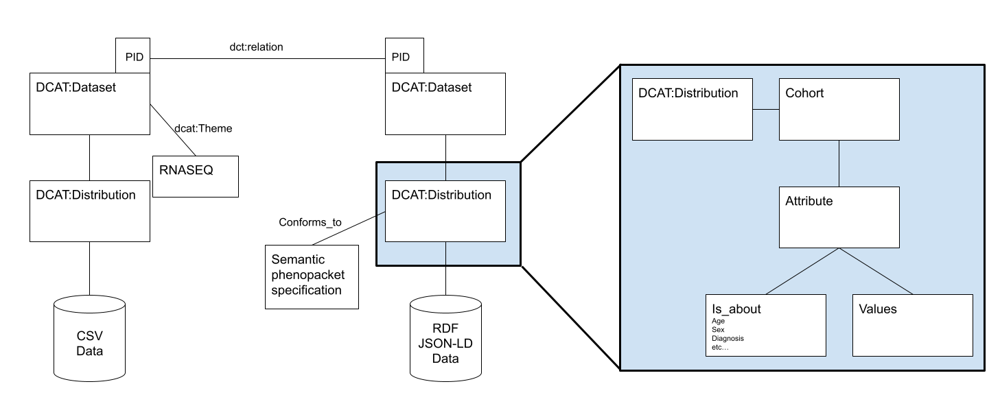

# Introduction

As part of the SWAT4HCLS BioHackathon 2024, we here report on the semantic phenopackets use for federated analytics. Our approach was to link phenopackets and omics datasets at metadata level. We were a group of participants representative of several international projects namely BIND [@citesAsAuthority:bind], EJP-RD [@citesAsAuthority:ejprd], Tokyo City University [@citesAsAuthority:tcu] and Maastricht University hospital [@citesAsAuthority:mu]. Our expertise ranges from Semantic Web technologies and metadata modelling to data stewarship.

## Project description

GA4GH Phenopackets is a standard to represent computable clinical data of patients and integrate it with genomic data. While Phenopackets is appropriate to represent patient level data, it is not clear how to link this data to omics resources that aggregate patient information for population studies. In order to address this challenge, we started using [semantic phenopackets](https://ceur-ws.org/Vol-3127/paper-4.pdf) to represent biosample metadata for individuals who participated in genotype-phenotype studies and publish it from a [FAIR Data Point](https://doi.org/10.1162/dint_a_00160). To follow-up the [BioHackathon Europe 2021 project](https://doi.org/10.37044/osf.io/ep3xh) on the modelling of semantic Phenopackets for the Semantic Web and FAIR federated learning/analytics, we propose enhancing interoperability between metadata description of omics analyses and metadata of individual patient data for federated learning/analysis using Phenopackets, FAIR and semantic technologies. Our objective during the BioHackathon is to investigate and harmonise metadata described in other federated ecosystems, and maybe perform queries crossing omics population level studies with phenopackets individual data.

# Methods

### Links
* Phenopackets schema: https://phenopacket-schema.readthedocs.io/en/latest/schema.html
* Phenopackets paper DOI: https://doi.org/10.1038/s41587-022-01357-4
* Semantic phenopackets paper: https://ceur-ws.org/Vol-3127/paper-4.pdf
* Semantic phenopackets GitHub: https://github.com/LUMC-BioSemantics/phenopackets-rdf-schema
* Example FAIR Data Point Núria: https://fdp.duchennedatafoundation.org/
* Example FAIR Data Point Daphne: https://patient-registries.fdps.ejprd.semlab-leiden.nl/catalog/be087100-64a1-4fb7-86ed-ca8e0efbd3a9
* Phenopackets-DCAT modelling: https://docs.google.com/drawings/d/1lZPkuQU01yYqbuBHnGrzmzoQYAvJ8GoJSi_U5tjN6Vs/edit?usp=sharing
* Semantic phenopackets v2: https://github.com/acopom/phenopackets-rdf-schema

### Game plan

| Tasks | Participants |
| -------- | -------- |
| Link phenopackets (PPs) and FAIR Data Point (based on DCAT) | @Daphne Wijnbergen @Daniela Vicentini Albring @Inês De Oliveira Coelho Henriques @César Bernabé @Chang Sun @Núria Queralt Rosinach |
| Extend semantic/RDF PPs to v2 | @atsuko @Chang Sun @Núria Queralt Rosinach  |
| Phenopackets metadata description  in the FAIR Data Point |  |
| Omics metadata description in the FAIR Data Point |  |

# Results

## Link phenopackets (PPs) and FAIR Data Point (based on DCAT)
Brainstorming models:

| Options for link | Advantages | Disadvantages | 
| -------- | -------- | -------- |
| Add phenopackets RDF to dcat:Dataset RDF, and add a triple to point from dcat:Dataset  to the phenopacket root node |  |  | 
| Make a new subclass from dcat:Resource for phenopackets, point to this from the dataset |  | Requires configuration of a new resource type in the FAIR Data Point to display new class |
| Have one dcat:Dataset for the omics data. Have one dcat:Dataset for the phenopacked. Make a link between the datasets with dct:relation. | Follows DCAT and FDP specification 100%. No extra configuration needed. | Querying is limited? |

### Draft linking model
Phenopackets-DCAT modelling: https://docs.google.com/drawings/d/1lZPkuQU01yYqbuBHnGrzmzoQYAvJ8GoJSi_U5tjN6Vs/edit?usp=sharing

### New semantics minted
http://purl.org/semantic-phenopackets

### Question list:
1. Can dct:relation be added to dcat:Dataset without failing FDP validation?
2. Put dct:conforms_to on dataset or distribution?
3. Is dct:conforms_to too expressive or we could start simpler adding a 'phenopackets' term as a _Theme_ in the FAIR Data Point?
4. Are we GDPR save describing patient aggregated data in the FAIR Data Point?
5. Can we calculate aggregated values such as 'age group' on the fly and dynamically updating them in the FAIR Data point?

## Extend semantic/RDF PPs to v2
Idea: use 'Data shapes' to describe/validate semantic phenopackets v2. Validator: https://rdfshape.weso.es/shexInfo
Semantic phenopackets v2: https://github.com/acopom/phenopackets-rdf-schema

### Semantic models
We decided to use the entity-attribute subpattern within the measurements design pattern to semantically model the phenopackets blocks.

#### Gene Descriptor
Semantic phenopackets v1: Non existing. We could based on https://github.com/LUMC-BioSemantics/phenopackets-rdf-schema/blob/master/images/sample_id.png , but we decided to use the entity-attribute subpattern.
Semantic phenopackets v2: 

#### Variant
Semantic phenopackets v1: Non existing.
Semantic phenopackets v2: https://github.com/acopom/phenopackets-rdf-schema/blob/master/shex/variant.shex

# Future work
1. Finish tasks _Link phenopackets (PPs) and FAIR Data Point ( based on DCAT)_ and _Extend semantic/RDF PPs to v2_
2. Start working on tasks _Phenopackets metadata description  in the FAIR Data Point_ and _Omics metadata description in the FAIR Data Point_
3. Try some queries to demonstrate our approach among distributed FAIR Data Points

# Formatting

This document use Markdown and you can look at [this tutorial](https://www.markdowntutorial.com/).

## Subsection level 2

Please keep sections to a maximum of only two levels.

## Tables and figures

Tables can be added in the following way, though alternatives are possible:

Table: Note that table caption is automatically numbered and should be
given before the table itself.

| Header 1 | Header 2 |
| -------- | -------- |
| item 1 | item 2 |
| item 3 | item 4 |

A figure is added with:

# Other main section on your manuscript level 1

Lists can be added with:

1. Item 1
2. Item 2

# Citation Typing Ontology annotation

You can use [CiTO](http://purl.org/spar/cito/2018-02-12) annotations, as explained in [this BioHackathon Europe 2021 write up](https://raw.githubusercontent.com/biohackrxiv/bhxiv-metadata/main/doc/elixir_biohackathon2021/paper.md) and [this CiTO Pilot](https://www.biomedcentral.com/collections/cito).
Using this template, you can cite an article and indicate _why_ you cite that article, for instance DisGeNET-RDF [@citesAsAuthority:Queralt2016].

The syntax in Markdown is as follows: a single intention annotation looks like
`[@usesMethodIn:Krewinkel2017]`; two or more intentions are separated
with colons, like `[@extends:discusses:Nielsen2017Scholia]`. When you cite two
different articles, you use this syntax: `[@citesAsDataSource:Ammar2022ETL; @citesAsDataSource:Arend2022BioHackEU22]`.

Possible CiTO typing annotation include:

* citesAsDataSource: when you point the reader to a source of data which may explain a claim
* usesDataFrom: when you reuse somehow (and elaborate on) the data in the cited entity
* usesMethodIn
* citesAsAuthority
* citesAsEvidence
* citesAsPotentialSolution
* citesAsRecommendedReading
* citesAsRelated
* citesAsSourceDocument
* citesForInformation
* confirms
* documents
* providesDataFor
* obtainsSupportFrom
* discusses
* extends
* agreesWith
* disagreesWith
* updates
* citation: generic citation

# Discussion

...

## Acknowledgements

...

## References
